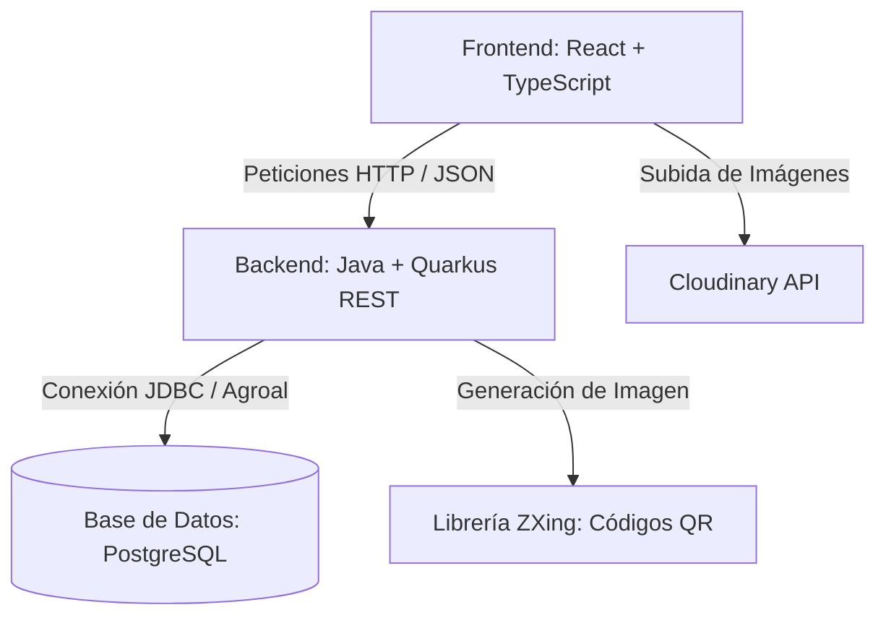

# Documentación de Sustentación: Sistema MAFER-G CRM + Calidad Textil

Este documento detalla la estructura, funcionamiento y arquitectura del sistema desarrollado para la empresa **MAFER-G**, con el objetivo de servir como base técnica para la redacción de la tesis y sustentación del proyecto.

---

## 1. Introducción y Propósito del Sistema
El sistema de **MAFER-G** es una plataforma integral de **CRM (Customer Relationship Management), Control de Calidad y Trazabilidad de Producción Textil**. Su propósito es automatizar y conectar las tres áreas clave de la empresa:
1. **Logística y Producción (Taller):** Controlando los lotes de prendas confeccionadas, los insumos consumidos, las máquinas utilizadas y la mano de obra para calcular costos unitarios reales.
2. **Punto de Venta (POS) y Gestión Comercial:** Permitiendo registrar transacciones mayoristas y minoristas con control de inventarios en tiempo real e impresión de tickets de venta con códigos QR únicos.
3. **Calidad y Fidelización (CRM):** Capturando el feedback del cliente final a través de encuestas NPS (Net Promoter Score) accesibles mediante códigos QR en las etiquetas de las prendas, disparando alertas de calidad y recompensando a los clientes con cupones de descuento automáticos.

---

## 2. Arquitectura Tecnológica
El proyecto se diseñó bajo una arquitectura desacoplada de tipo **Cliente-Servidor**:

* **Frontend (Cliente):** Desarrollado en **React** con **TypeScript**, estructurado en componentes modulares y estilizado mediante **Tailwind CSS**. Implementa enrutamiento dinámico, interceptores de seguridad para inyectar tokens JWT en las peticiones administrativas y widgets para la subida de imágenes a la nube (**Cloudinary**).
* **Backend (Servidor):** Construido en **Java** usando el framework **Quarkus** (con la extensión RESTEasy Reactive para endpoints RESTful). Utiliza un pool de conexiones optimizado con **Agroal** y consultas SQL nativas parametrizadas para maximizar el rendimiento y la seguridad contra inyección de código.
* **Base de Datos:** Motor relacional **PostgreSQL** diseñado bajo la tercera forma normal (3FN) que consta de **28 tablas** indexadas para búsquedas de alta concurrencia.
* **Seguridad:** Implementa autenticación basada en roles (`ADMINISTRADOR`, `OPERADOR`, `ATENCION_CLIENTE`, `VENTAS`) y autorización mediante un filtro de seguridad HTTP (`SecurityFilter`) que valida tokens firmados.

---

## 3. Desglose de Módulos del Sistema

### Módulo 1: Catálogo de Productos Público y Ventas Manuales
* **Venta al Público:** El catálogo en línea muestra de forma atractiva las prendas premium organizadas por categorías infantiles (Conjuntos, Vestidos, Pantalones, etc.), recuperando los datos del endpoint público del backend.
* **Pedidos por WhatsApp:** Los clientes pueden seleccionar una prenda y hacer clic en un enlace directo de WhatsApp. El sistema formatea automáticamente un mensaje de texto de WhatsApp con el nombre del producto, SKU, composición, precio y el cupón de descuento activo si el cliente cuenta con uno.
* **Fidelización:** Si un cliente cuenta con un cupón de descuento válido (ej. `MAFERG-XXXXXX`), el catálogo calcula y visualiza de forma dinámica el precio neto con un 5% de descuento antes de derivarlo al chat comercial.

### Módulo 2: Encuesta de Calidad NPS y Gestión de Alertas
* **Acceso mediante QR:** Al adquirir una prenda, el ticket de venta o la etiqueta incluye un código QR único. Al escanearlo, el cliente es dirigido al portal web de encuestas (`/public?token=...`) que recupera la información del lote confeccionado de forma transparente.
* **Flujo de la Encuesta:**
  1. **Datos de Contacto (Opcional):** El cliente decide si desea registrar sus datos (nombre, correo o teléfono) para recibir cupones.
  2. **Calificación de Experiencia (NPS):** Se solicita calificar la calidad de la prenda de 0 a 10:
     * **Promotor (9-10):** El cliente manifiesta máxima satisfacción. El sistema le agradece y le otorga al instante un **cupón de descuento de fidelización** del 5%.
     * **Pasivo (7-8):** Calificación neutral. El sistema registra los datos para control estadístico.
     * **Detractor (0-6):** Insatisfacción. Se le solicita clasificar el tipo de inconveniente (tejido, costuras, daños, demoras, etc.) y describir los detalles.
  3. **Disparo de Alertas de Calidad:** Si el cliente es **Detractor**, el backend inserta de manera automática un registro en la tabla `alerta_calidad` en estado `PENDIENTE`. Al mismo tiempo, el frontend muestra un botón destacado para que el usuario pueda contactar directamente al soporte técnico por WhatsApp, enviando un mensaje con los datos del lote afectado.
  4. **Fidelización por Molestias:** Para mitigar la mala experiencia de un cliente detractor, el sistema **también le genera un cupón de descuento automático** para su próxima compra.

### Módulo 3: Control de Operaciones en el Taller (Trazabilidad y Costos)
* **Creación de Lotes:** Los administradores u operarios registran los lotes de confección especificando el código de lote, el modelo de prenda y la cantidad inicial de unidades a producir.
* **Bitácora de Producción (Timeline):** Cada lote cuenta con un historial o bitácora de confección en el taller donde se añaden las operaciones realizadas paso a paso:
  - **Operaciones:** Corte, Costura, Remalle, Collareta, Ojal y Botón, Acabado, Planchado, Control de Calidad y Empaque.
  - **Asignación:** Se registra el operario a cargo de la tarea y la máquina industrial utilizada.
* **Costeo Real:**
  - **Insumos:** Permite agregar al lote los insumos consumidos (metros de tela, conos de hilo, botones, cierres) indicando cantidades y costos totales.
  - **Mano de Obra:** Los administradores asignan el costo real cobrado por cada operación del taller.
  - **Costo Unitario Real:** El sistema suma el costo de insumos y mano de obra para dividirlo entre la cantidad confeccionada, calculando de manera exacta el **Costo Unitario de Producción** del lote, clave para determinar los márgenes de ganancia.

### Módulo 4: Panel de Control (Admin Dashboard) y Módulo POS
* **Dashboard Administrativo:** Muestra KPIs clave en tiempo real:
  - NPS Estimado general de la empresa.
  - Total de respuestas recopiladas e indicadores del día.
  - Distribución de clientes (Promotores, Pasivos y Detractores) mediante gráficos circulares e históricos.
  - Historial de auditoría para registrar las acciones realizadas por cada usuario en el sistema.
* **Bandeja de Alertas:** Los administradores visualizan y gestionan las alertas de calidad abiertas por detractores, pudiendo escribir comentarios de resolución y cerrarlas una vez atendidas.
* **Modulo POS (Punto de Venta):** Permite a los vendedores registrar transacciones de venta mayorista y minorista de manera sumamente ágil:
  - Selector de lotes de producción disponibles (bloquea la venta si el lote no tiene stock).
  - Selector de venta por docenas o unidades individuales con cálculo de equivalencias.
  - Verificación del código de cupón de descuento del cliente para aplicarlo a la venta.
  - Formulario rápido para asociar clientes existentes o registrar nuevos clientes (capturando su correo y teléfono para futuras campañas de marketing).
* **Impresión de Tickets de Venta:** Genera una ventana optimizada de impresión térmica con el desglose de productos, cantidades, subtotal, descuentos, monto neto cobrado y la renderización dinámica de la etiqueta con código QR.

---

## 4. Estructura de la Base de Datos (Esquema Físico)
El diseño relacional consta de tablas normalizadas en PostgreSQL que aseguran la consistencia de los datos y previenen la redundancia:

1. **rol:** Define los roles del sistema (`ADMINISTRADOR`, `OPERADOR`, `ATENCION_CLIENTE`, `VENTAS`).
2. **usuario:** Datos de trabajadores y credenciales administrativas (contraseñas encriptadas mediante hashes seguros).
3. **sesion_usuario:** Registro de sesiones de usuarios activos.
4. **log_sistema:** Tabla de auditoría interna de actividades críticas.
5. **categoria_producto:** Categorización de prendas infantiles.
6. **producto:** Catálogo maestro de productos (SKU, nombre, descripción, materiales, cuidados, precio e imagen).
7. **tipo_operacion:** Catálogo de procesos textiles del taller (código, nombre y tiempo estimado).
8. **tipo_maquina:** Clasificación de maquinaria (ej. Recta, Remalladora).
9. **maquina:** Inventario de máquinas de confección en el taller con estado de actividad.
10. **lote_produccion:** Cabecera de los lotes confeccionados con cantidad de prendas y stock disponible.
11. **lote_proceso:** Operaciones registradas en el taller asociadas a un lote, operario, máquina y costo.
12. **proveedor:** Registro de proveedores de insumos (RUC, nombre, contacto).
13. **insumo_textil:** Catálogo de materiales disponibles (telas, hilos, avíos).
14. **lote_insumo:** Control de compras de insumos vinculados a lotes de producción.
15. **lote_insumo_consumido:** Materiales específicos consumidos y su costo dentro de un lote de prendas.
16. **tarifa_operacion:** Tarifas predefinidas para el cobro de operaciones por prenda.
17. **departamento / provincia / distrito:** Tablas geográficas (Ubigeo) para segmentar las direcciones de clientes.
18. **cliente:** Cabecera común de clientes registrados (nombre, contacto, ciudad).
19. **cliente_b2b:** Datos comerciales específicos de mayoristas (RUC, contacto, rubro).
20. **cliente_b2c:** Datos específicos de clientes minoristas (DNI, apellidos).
21. **campana_marketing:** Campañas promocionales asociadas a los cupones.
22. **venta:** Transacciones comerciales realizadas con desglose y generación de token QR de calidad.
23. **detalle_venta:** Artículos específicos vendidos en cada transacción.
24. **evaluacion_nps:** Feedback y puntaje de la encuesta registrado por el cliente.
25. **alerta_calidad:** Alertas abiertas de detractores para investigación.
26. **historial_alerta:** Bitácora de seguimiento de incidentes de calidad.
27. **cupon_fidelizacion:** Cupones de 5% de descuento generados con vigencia de 30 días.
28. **historial_reconocimiento:** Historial de beneficios y premios entregados a los clientes.
